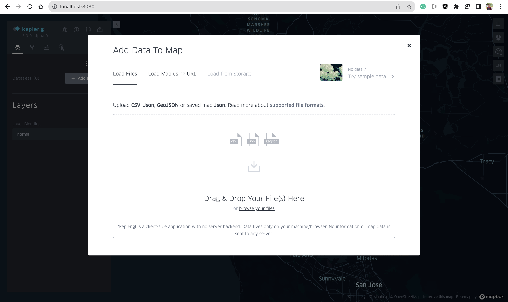

# kepler-gl-docker

<p float="left">
 

</p>

This code deploys kepler.gl [demo-app](https://github.com/keplergl/kepler.gl/tree/master/examples/demo-app) in docker container





## Run the application using *docker compose*
1. Update the `MapboxAccessToken` in [.env](./env) (it is not necessary to have token to start the application).
2. Change the `KEPLER_PORT` in [.env](./env) if 8080 port is not available to use.
3. Run `docker compose up -d` to start the application, it will pull the image and run the application on [http://localhost:8080](http://localhost:8080) or `http://localhost:<KEPLER_PORT>/` if port is changed.
4. To stop and remove the container run `docker compose down`


## Run the application using *docker run*

1. Pull the image using following command
```bash
docker pull krishnakhadka/keplergl:latest
```

2. Run the container 
```bash
docker run --name keplergl -p 8080:8080 -d krishnakhadka/keplergl:latest
```

3. Provide MapboxAccessToken in the run command (if available)
```bash
docker run --name keplergl -p 8080:8080 -e MapboxAccessToken="GeneratedMapboxAccessToken" -d krishnakhadka/keplergl:latest
```

## Build the application from *Dockerfile*
Following command can be used for building the image 
```bash
docker build -t krishnakhadka/keplergl https://github.com/khadkakrishna/kepler-gl-docker.git
```

### Buildx for pushing multi-architecture images

Create a new builder
> docker buildx create --name mybuilder --bootstrap --use
> docker buildx use mybuilder
> docker buildx inspect mybuilder

build the Docker Image for arm64 and amd64
> docker buildx build --push --platform linux/arm64,linux/amd64 --tag krishnakhadka/keplergl:latest .

inspect the image
> docker buildx imagetools inspect krishnakhadka/keplergl:latest

remove buildx builder
> docker buildx rm mybuilder
